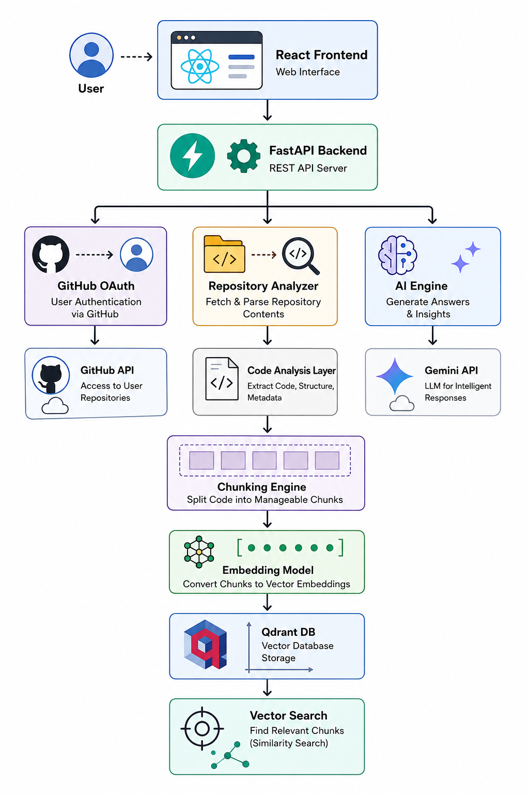

# AI-Powered GitHub Repository Analyzer
Built an AI-powered GitHub Repository Analyzer using React, FastAPI, Gemini, and Qdrant. The platform analyzes GitHub repositories, generates code quality insights, detects project architecture, and enables repository-aware AI conversations using Retrieval-Augmented Generation (RAG). Implemented GitHub OAuth for public and private repository access, semantic code search using vector embeddings, and AI-powered repository intelligence through Gemini and Qdrant.


## 📋 Table of Contents

- [Overview](#overview)
- [Key Features](#key-features)
- [Architecture](#architecture)
- [RAG Pipeline](#rag-pipeline)
- [Tech Stack](#tech-stack)
- [Installation](#installation)
- [Configuration](#configuration)
- [Usage](#usage)
- [Project Structure](#project-structure)
- [Future Improvements](#future-improvements)
- [Screenshots](#screenshots)
- [Contributing](#contributing)
- [License](#license)

---

## 🚀 Overview

**AI-Powered GitHub Repository Analyzer** is an intelligent system that enables semantic understanding and analysis of GitHub repositories through advanced AI and vector databases. It combines Retrieval-Augmented Generation (RAG) with Google's Gemini AI to provide context-aware, repository-specific answers about codebases.

### What It Does

1. **Analyzes** repository structure, dependencies, and code complexity
2. **Embeds** source code semantically using Sentence Transformers
3. **Stores** embeddings in Qdrant vector database for efficient retrieval
4. **Retrieves** relevant code chunks based on semantic similarity
5. **Generates** AI-powered insights using Google Gemini

### Use Cases

- 📚 **Code Discovery**: Understand large codebases quickly
- 🔍 **Code Search**: Natural language semantic search
- 📖 **Documentation**: Auto-generate documentation insights
- 💡 **Learning**: Learn how popular open-source projects work
- 🛠️ **Onboarding**: Accelerate developer onboarding
- 🐛 **Debugging**: Get context-aware debugging suggestions

---

## ✨ Key Features

### Core Capabilities

| Feature | Description |
|---------|-------------|
| 🔐 **GitHub OAuth Authentication** | Secure login with GitHub account |
| 🌐 **URL-based Access** | Paste any GitHub repository URL |
| 🔓 **Private Repository Support** | Access private repos with OAuth token |
| 💬 **Intelligent Chat Interface** | Ask questions about the codebase naturally |
| 🧠 **Semantic Code Search** | Find code using natural language queries |
| 📊 **Code Analysis** | Complexity metrics, language detection, dependencies |
| 🏗️ **Architecture Detection** | Automatic project type identification |
| 💾 **Smart Caching** | Reuse embeddings across sessions |
| 📈 **Scalable Processing** | Handle repositories of varying sizes |

### AI-Powered Insights

- Code complexity scoring
- Dependency graph analysis
- Language distribution
- Project type classification
- AI-generated repository summaries
- Context-aware code explanations

---

## 🏛️ Architecture


### Pipeline Steps

1. **Question Embedding**: User question converted to 384-dimensional vector
2. **Semantic Search**: Qdrant finds semantically similar code chunks
3. **Context Retrieval**: Top matching chunks ranked and retrieved
4. **Prompt Engineering**: Context formatted with question for LLM
5. **LLM Generation**: Gemini generates repository-aware response
6. **Response Streaming**: Real-time response streaming to user

---

## 💻 Tech Stack

### Frontend
- **React 18+** - Modern UI framework
- **Vite** - Lightning-fast build tool
- **ESLint** - Code quality
- **Responsive Design** - Mobile-friendly interface

### Backend
- **FastAPI** - High-performance Python framework
- **Python 3.10+** - Core language
- **Pydantic** - Data validation

### AI/ML
- **Google Gemini API** - Large Language Model
- **Sentence Transformers** - 384-dimensional embeddings
- **Qdrant** - Vector database for semantic search

### Infrastructure
- **Docker** - Containerization
- **GitHub API** - Repository data
- **GitHub OAuth 2.0** - Authentication

### Data Processing
- **AST Parsing** - Code structure analysis
- **PyGithub** - GitHub integration
- **Langchain** - LLM orchestration

---

## 📦 Installation

### Prerequisites

- Python 3.10 or higher
- Node.js 16+ and npm
- Docker and Docker Compose (optional, for containerized deployment)
- GitHub OAuth App credentials
- Google Gemini API key

### Local Development Setup

#### 1. Clone the Repository

```bash
git clone https://github.com/yourusername/AI-Powered-Github-Analyzer.git
cd AI-Powered-Github-Analyzer
```

#### 2. Backend Setup

```bash
# Navigate to backend directory
cd Backend

# Create virtual environment
python -m venv venv

# Activate virtual environment
# On Windows:
venv\Scripts\activate
# On macOS/Linux:
source venv/bin/activate

# Install dependencies
pip install -r requirements.txt

# Create .env file
cp .env.example .env
# Edit .env with your credentials
```

#### 3. Frontend Setup

```bash
# Navigate to frontend directory
cd ../frontend

# Install dependencies
npm install

# Create .env file
cp .env.example .env
# Edit .env with your API endpoint
```

#### 4. Start Services

```bash
# Terminal 1: Start Backend
cd Backend
source venv/bin/activate
python app.py

# Terminal 2: Start Frontend
cd frontend
npm run dev
```

### Docker Deployment

```bash
# Build and run with Docker Compose
docker-compose up --build

# Access the application
# Frontend: http://localhost:5173
# Backend API: http://localhost:8000
# API Docs: http://localhost:8000/docs
```

---

## ⚙️ Configuration

### Environment Variables

#### Backend (.env)

```env
# GitHub OAuth
GITHUB_CLIENT_ID=your_github_client_id
GITHUB_CLIENT_SECRET=your_github_client_secret
GITHUB_CALLBACK_URL=http://localhost:8000/auth/callback

# Google Gemini API
GEMINI_API_KEY=your_gemini_api_key
GEMINI_MODEL=gemini-2.0-flash

# Qdrant Vector Database
QDRANT_URL=http://localhost:6333
QDRANT_API_KEY=your_qdrant_api_key

# Repository Processing
TEMP_REPO_PATH=./temp_repos
GITHUB_TOKEN=your_github_personal_access_token

# Embedding Configuration
EMBEDDING_MODEL=sentence-transformers/all-MiniLM-L6-v2
EMBEDDING_DIMENSION=384

# Server Configuration
HOST=0.0.0.0
PORT=8000
DEBUG=false
```

#### Frontend (.env)

```env
VITE_API_URL=http://localhost:8000
VITE_GITHUB_CLIENT_ID=your_github_client_id
VITE_GITHUB_CALLBACK_URL=http://localhost:5173/callback
```

### GitHub OAuth Setup

1. Go to GitHub Settings → Developer settings → OAuth Apps
2. Create a new OAuth App
3. Set Authorization callback URL to: `http://localhost:8000/auth/callback`
4. Copy Client ID and Client Secret to your `.env` file

### Google Gemini API Setup

1. Go to [Google AI Studio](https://aistudio.google.com/)
2. Create a new API key
3. Add to your `.env` file

### Qdrant Setup

```bash
# Run Qdrant with Docker
docker run -p 6333:6333 -p 6334:6334 \
  -e QDRANT_API_KEY=your_qdrant_api_key \
  qdrant/qdrant:latest
```

---

## 🎯 Usage

### Step 1: Authentication
- Click "Login with GitHub"
- Authorize the application
- Grant access to your repositories

### Step 2: Analyze a Repository
- Paste a GitHub repository URL
- Click "Analyze Repository"
- Wait for processing (embedding generation)

### Step 3: Interactive Chat
- Ask questions about the codebase
- View AI-generated answers with code context
- Explore code suggestions and insights

### Example Queries
```
- "What is the main purpose of this repository?"
- "How does the authentication system work?"
- "What are the key dependencies?"
- "Explain the database schema"
- "What design patterns are used in this codebase?"
- "How is error handling implemented?"
```

### API Endpoints

```bash
# Authentication
POST /auth/github
GET /auth/callback

# Repository Analysis
POST /api/repositories/analyze
GET /api/repositories/{repo_id}

# Chat Interface
POST /api/chat/{repo_id}
GET /api/chat/{repo_id}/history

# Code Search
POST /api/search/{repo_id}

# Analysis Data
GET /api/analysis/{repo_id}/complexity
GET /api/analysis/{repo_id}/languages
GET /api/analysis/{repo_id}/dependencies
```

See [API Documentation](http://localhost:8000/docs) for detailed endpoint specifications.

---

## 📂 Project Structure

```
AI-Powered-Github-Analyzer/
├── Backend/
│   ├── app.py                 # FastAPI application entry point
│   ├── service/
│   │   ├── analyzer.py        # Code analysis service
│   │   ├── repo_service.py    # GitHub repository operations
│   │   ├── gemini_service.py  # Gemini AI integration
│   │   ├── qdrant_service.py  # Vector database operations
│   │   └── create_chunk.py    # Code chunking logic
│   ├── utils/
│   │   ├── code_complexity.py # Complexity metrics
│   │   ├── language_utils.py  # Language detection
│   │   ├── embed_chunks.py    # Embedding generation
│   │   ├── search_chunk.py    # Semantic search
│   │   └── build_chat_prompt.py # Prompt engineering
│   ├── chat_history/          # Chat persistence
│   └── repo_indexes/          # Repository metadata cache
│
├── frontend/
│   ├── src/
│   │   ├── components/        # React components
│   │   ├── pages/            # Page components
│   │   ├── App.jsx           # Main app component
│   │   └── main.jsx          # Entry point
│   ├── public/               # Static assets
│   ├── package.json
│   └── vite.config.js
│
└── docker-compose.yml        # Docker orchestration
```

---

## 🧠 How It Works

### 1. Repository Analysis Phase
- Repository is cloned from GitHub
- Project structure is analyzed
- Dependencies are extracted
- Code complexity is calculated
- Language distribution is determined

### 2. Code Chunking Phase
- Source files are read
- Code is split into semantic chunks (functions, classes, logical blocks)
- Metadata is preserved (file path, line numbers, code type)
- Chunks are deduplicated and cleaned

### 3. Embedding & Indexing Phase
- Each chunk is converted to a 384-dimensional vector
- Embeddings are generated using Sentence Transformers
- Vectors are stored in Qdrant with metadata
- Index is persisted for future queries

### 4. Query & Retrieval Phase
- User question is embedded using same model
- Semantic similarity search in Qdrant
- Top-K relevant chunks are retrieved
- Context is ranked and filtered

### 5. Response Generation Phase
- Retrieved context is formatted with the question
- Prompt is sent to Google Gemini API
- LLM generates repository-aware response
- Response is streamed to user in real-time

---

## 🔮 Future Improvements

### Planned Features

- **Multi-Repository Analysis**
  - Compare code patterns across repositories
  - Cross-repo dependency analysis

- **Advanced Code Search**
  - Regex and AST-based search
  - Code snippet suggestions
  - Similar code pattern detection

- **Team Collaboration**
  - Shared analysis workspaces
  - Team chat history
  - Collaborative code review insights

- **Enhanced Analytics**
  - Code quality dashboard
  - Performance metrics
  - Security vulnerability scanning

- **Extended AI Capabilities**
  - Multi-turn conversations with memory
  - Code generation from descriptions
  - Automated documentation generation
  - Test case generation

- **Developer Tools Integration**
  - VS Code Extension
  - GitHub App integration
  - IDE plugins

- **Scalability Improvements**
  - Distributed processing
  - Batch repository analysis
  - Caching optimization
  - Load balancing

- **Model Improvements**
  - Support for multiple LLM providers
  - Fine-tuned models for code
  - Streaming response optimization

---

## 📸 Screenshots

### Authentication


### Repository Analysis


### Chat Interface


### Code Insights


### API Documentation


---

## 🤝 Contributing

Contributions are welcome! Please follow these steps:

1. Fork the repository
2. Create a feature branch (`git checkout -b feature/AmazingFeature`)
3. Commit your changes (`git commit -m 'Add AmazingFeature'`)
4. Push to the branch (`git push origin feature/AmazingFeature`)
5. Open a Pull Request

### Development Guidelines

- Follow PEP 8 for Python code
- Use ESLint for JavaScript/React code
- Write meaningful commit messages
- Add tests for new features
- Update documentation as needed

### Reporting Issues

- Use GitHub Issues for bug reports
- Provide detailed reproduction steps
- Include error messages and logs
- Specify your environment details

---

## 📝 License

This project is licensed under the MIT License - see [LICENSE](LICENSE) file for details.

---

## 🙏 Acknowledgments

- [Google Gemini API](https://ai.google.dev/) for LLM capabilities
- [Qdrant](https://qdrant.tech/) for vector database
- [FastAPI](https://fastapi.tiangolo.com/) for backend framework
- [React](https://react.dev/) for frontend framework
- [Sentence Transformers](https://www.sbert.net/) for embeddings
- Open-source community for inspiration and support

---

## 📞 Support

For questions and support:

- 📧 Email: support@example.com
- 💬 GitHub Discussions: [Discussions](https://github.com/yourusername/AI-Powered-Github-Analyzer/discussions)
- 🐛 Bug Reports: [Issues](https://github.com/yourusername/AI-Powered-Github-Analyzer/issues)
- 📖 Documentation: [Wiki](https://github.com/yourusername/AI-Powered-Github-Analyzer/wiki)

---

<div align="center">

**Built with ❤️ using FastAPI, React, and AI**

*Making GitHub repositories searchable, understandable, and accessible*

[⬆ Back to Top](#ai-powered-github-repository-analyzer)

</div>
